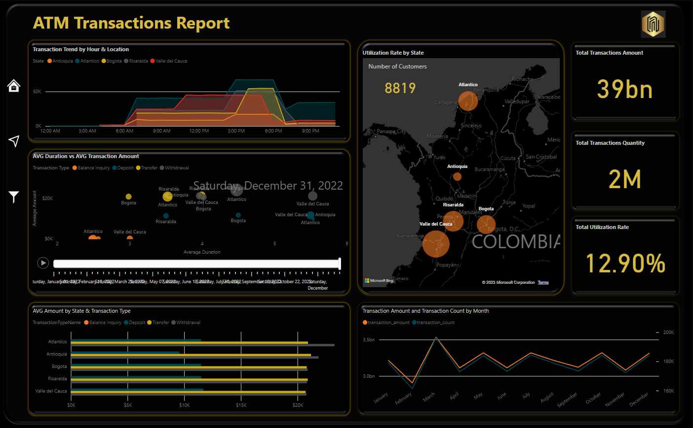
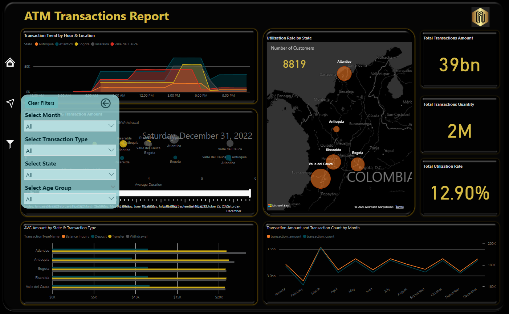
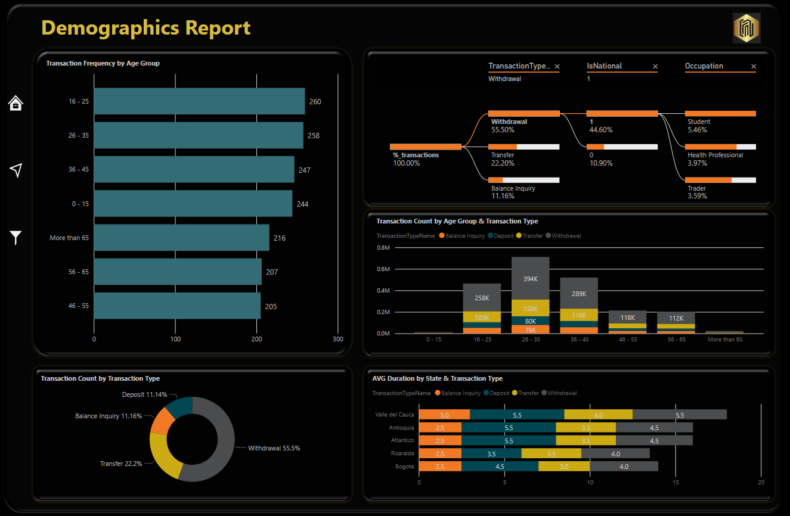

# ATM Data Analysis in PowerBI
The data analytics project will analyze the ATM transactions data, including the Transactions fact table, Location dimension table, Customers Dimension table, Transaction Type Dimension Table, Hour dimension table, and Calendar dimension. The analysis will involve data cleaning, transformation, and visualization using Power BI.

The expected deliverables from the data analytics project are a set of reports and dashboards that provide insights and answers to business problem questions such as: What is the average transaction amount by location and transaction type, What is the trend of transaction volume and transaction amount over time, and solve other questions that will enable the National Bank team to make data-driven decisions that improve customer experience and optimize operations.

## Home page:
The first page contains brief information on the utilization rate of the ATM by city and also has buttons that link to other pages in the report.

## Overview page:
This page contains diverse visualizations of general figures about the transactions by different segmentations with dynamic filters the get more detailed information.

## Demographic page:
The Demography page shows visualizations of general figures about the behavior of the ATM by different perspectives of client's information, also has dynamic filters the get more detailed information and buttons to navigate through the report.

