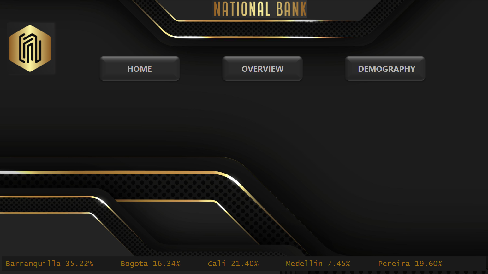

# ATM Data Analysis in PowerBI
### The data analytics project will involve analyzing the ATM transactions data, which includes the Transactions fact table, Location dimension table, Customers Dimension table, Transaction Type Dimension Table, Hour dimension table, and Calendar dimension. The analysis will involve data cleaning, data transformation, and data visualization using Power BI.

### The expected deliverables from the data analytics project are a set of reports and dashboards that provide insights and answers to business problem questions such as: What is the average transaction amount by location and transaction type, What is the trend of transaction volume and transaction amount over time, and solve other questions that will enable the National Bank team to make data-driven decisions that improve customer experience and optimize operations.

## Home Page:
### The first page contains brief information on the utilization rate of the ATM by city and also has buttons that link to other pages in the report.

